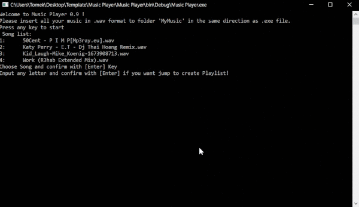

# Music-Player
 Console based music player.

-----------------------------------------
# Introduction

This app is made for example of my .Net C# console app knowledge. It's simple program made to play your music with minimum system load in most intuitive way, the console app can. Music player have implementent typical for graphic based players functions, like playlist, and auto-loop. App don't need to be installed, just generate .exe file and put the .wav format music in same location. Voilà! It's that simple!

------------------------------------------
# Technologies

App is programmed in C# language, based on .Net framework in version 4.7.1, for correct working i reccomend update/ install minimum this version. Libraries used in project:
* Text.RegularExpressions (C# built in library)
* IO (C# built in library)
* Runtime.InteropServices (C# built in library)
* Windows.Media (C# library for reading music format)
* NAudio (open source library: [Author's Page](https://github.com/naudio/NAudio)

------------------------------------------
# Setup

To open app...

------------------------------------------
# Features

------------------------------------------
# Motivation

------------------------------------------
# Others
### Improve

### Report Bug

### To-Do

### License
